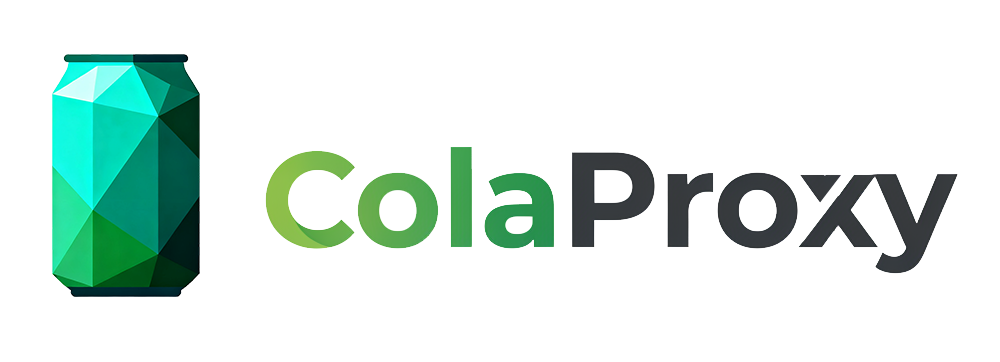

<div align="center">

# Any Auto Register

Account automation for 11+ AI platforms · Protocol / browser dual-mode · One-click Mac / Windows desktop

<p>
  <a href="https://github.com/lxf746/any-auto-register/stargazers"></a>
  <a href="https://github.com/lxf746/any-auto-register/releases/latest"></a>
  <a href="https://github.com/lxf746/any-auto-register/releases"></a>
  <a href="https://github.com/lxf746/any-auto-register/network/members"></a>
  <a href="LICENSE"></a>
</p>

<p>
  <a href="https://github.com/lxf746/any-auto-register/releases/latest"><b>Download desktop</b></a>
  &nbsp;·&nbsp;
  <a href="#what-it-solves">What it solves</a>
  &nbsp;·&nbsp;
  <a href="#at-a-glance">Screenshots</a>
  &nbsp;·&nbsp;
  <a href="#community">Community</a>
  &nbsp;·&nbsp;
  <a href="README.md">中文</a>
  &nbsp;·&nbsp;
  <a href="README_vi.md">Tiếng Việt</a>
</p>


</div>

---

> **This is the official upstream of [`lxf746/any-auto-register`](https://github.com/lxf746/any-auto-register)** — the original author's repository with the most timely updates. Other repositories with the same name are forks.

> For learning and research only. Not for commercial misuse. Users are responsible for evaluating and complying with the terms of service of the targeted platforms, and for any consequences that arise from use.

## What it solves

Most similar projects only answer *"how do I register one platform"* and leave the engineering gaps wide open: how to manage mailboxes, get past captchas, rotate proxies, keep accounts alive after registration, refresh expired tokens, diagnose failures. Any Auto Register handles all of it.

| | Other tools | Any Auto Register |
|---|---|---|
| Deployment | CLI / Docker / `.py` scripts | Desktop client (Mac / Win), double-click to run, embedded React UI |
| Platform coverage | 1-3 | 11+ platforms + Anything generic adapter, plugin-based extension |
| Mailbox options | Mostly IMAP | 9 channels: MoeMail / Cloudflare self-hosted / TempMail / DDG Email, etc. |
| Execution mode | Browser only | Pure protocol (fastest) / Headless / Headed |
| Full lifecycle | Register and forget | Scheduled checks + token refresh + trial warning + risk center alerts |
| Analytics | None | Success-rate dashboard with error attribution (proxy banned / mailbox failed / second-factor) |
| API gateway sync | None | Auto-push to [Any2API](https://github.com/lxf746/any2api), unified OpenAI-compatible protocol layer |
| Architecture | Usually hardcoded | Fully pluggable: platform / mailbox / captcha / SMS / proxy all hot-swappable |

Pair with the [`Any2API`](https://github.com/lxf746/any2api) gateway for an end-to-end pipeline: **bulk-register → auto-push → instantly usable as OpenAI / Claude-compatible API**.

## At a glance

> Screenshots from the latest desktop build (`v1.0.29`), updated with each release. The hero image above is the Overview dashboard — six real-time indicators (total / alive / failed / today's registrations / queue / retries), with a stacked success-rate + lifecycle-monitoring view and a local-runtime summary panel. Below are the other workspaces:

### Account pool — unified multi-platform management

Per-platform tabs, with passwords / steward / status / quota / payment link / last query time visible at a glance. Search, bulk import / export, copy single rows, open payment links.


### Task queue — batch registration and history

All tasks vs. running tasks at a glance. Each card shows platform, success / total, timestamp, and status. Pause everything, clear the queue, or open the live log for one task.


### Registration log — real-time step tracing

Every step of the registration flow is streamed to the frontend via SSE — OAuth code exchange, token issuance, quota query, all visible. When something fails, you see exactly which step.


### Settings — desktop-side preferences

Theme / language / global default proxy, plus desktop-only switches: launch at boot, minimize to tray, close-to-tray, check updates on launch, auto-backup directory.


## Core capabilities

Grouped by responsibility:

**Registration flow**

- **Platforms**: ChatGPT / Cursor / Kiro / Trae.ai / Tavily / Grok / Blink / Cerebras / OpenBlockLabs / Windsurf, plus the Anything generic adapter
- **Mailboxes**: MoeMail self-hosted / Cloudflare Worker self-hosted / Laoudo / DuckMail / Testmail / Freemail / TempMail.lol / Temp-Mail Web / DuckDuckGo Email
- **Captcha**: YesCaptcha / 2Captcha / local Solver (Camoufox)
- **SMS**: SMS-Activate / HeroSMS
- **Execution modes**: protocol (no browser, fastest) / Headless / Headed, switchable per platform
- **Local 2FA**: built-in TOTP generator, no third-party app needed

**Operations**

- **Lifecycle**: scheduled validity check + token auto-refresh + trial warning, one-click refresh from the dashboard
- **Risk center**: centralized alerts for *Token expired* / *Trial running out* / *Proxy unreachable*
- **Success-rate stats**: global success rate + error attribution (first-try / second-factor / proxy banned / mailbox failure), broken down by platform / day / proxy
- **Task queue**: batch registration history + live progress + per-task logs

**System**

- **Proxy pool**: static (success-rate weighted) + dynamic API extraction + rotating gateway, auto-disable on failure
- **Any2API sync**: auto-push registered accounts to the gateway — ready to use immediately
- **Export formats**: JSON / CSV / CPA / Sub2API / Kiro-Go / Any2API `admin.json`
- **Concurrency & logging**: configurable concurrency, SSE live logs, persistent task runner
- **Plugin architecture**: platform / mailbox / captcha / SMS / proxy drivers — all hot-swappable

## Quick start

### Desktop (recommended)

> 🚀 Zero config. Electron bundles the full backend + frontend, double-click and go.

| Platform | Download |
|------|------|
| 🍎 macOS (Intel / Apple Silicon) | [Get `.dmg` from Releases](https://github.com/lxf746/any-auto-register/releases/latest) |
| 🪟 Windows | [Get `.exe` from Releases](https://github.com/lxf746/any-auto-register/releases/latest) |

Install → launch → enter activation code ([get one from the group](#community)) → pick a platform → configure mailbox → start registering.

### Docker

```bash
mkdir -p any-auto-register && cd any-auto-register

cat > docker-compose.yml <<'EOF'
services:
  app:
    image: ghcr.io/lxf746/any-auto-register:latest
    ports:
      - "8000:8000"   # Web UI
      - "6080:6080"   # noVNC (visualize the browser)
      - "8889:8889"   # Turnstile Solver
    environment:
      - DISPLAY=:99
      # - APP_PASSWORD=changeme
    volumes:
      - ./data:/app/data
    restart: unless-stopped
EOF

docker compose up -d
```

| Service | URL | Notes |
|------|------|------|
| Web UI | `http://localhost:8000` | Main interface |
| noVNC | `http://localhost:6080/vnc.html` | Watch the browser (headed mode) |
| Solver | `http://localhost:8889` | Turnstile captcha solver |

When deploying to a cloud server, open ports `8000` / `6080` / `8889`.

### From source

> The source tree contains the core registration flow and the full provider system — fine for self-hosting and extension. Advanced task-queue controls, license management, payment-flow enhancements, and the latest platform adaptations ship with the desktop build.

Requires Python 3.11+ / Node.js 18+:

```bash
git clone https://github.com/lxf746/any-auto-register.git
cd any-auto-register/account_manager

python3 -m venv .venv && source .venv/bin/activate
pip install -r requirements.txt

cd frontend && npm install && npm run build && cd ..

# Optional — required for browser modes
python3 -m playwright install chromium
python3 -m camoufox fetch

python3 -m uvicorn main:app --port 8000
```

Open `http://localhost:8000`. For frontend hot-reload see [Development](#development).

## Configuration

### Mailbox providers

Pick a mailbox service to receive verification codes. Mailbox, captcha, and SMS configs are driven by a backend provider catalog — the **Settings** page in the Web UI is list-style CRUD: existing configs on the left, unified editor on the right. New providers added on the backend appear automatically after a refresh — no frontend code changes needed.

| Provider | Notes |
|----------|------|
| **MoeMail** (recommended) | Self-hosted temp mail based on [cloudflare_temp_email](https://github.com/dreamhunter2333/cloudflare_temp_email). No config needed — addresses generated on the fly. |
| **Laoudo** | Fixed custom-domain mailboxes. Highest stability, good for long-term use. |
| **Cloudflare Worker self-hosted** | Deploy your own based on `cloudflare_temp_email`. Full control. |
| **Testmail** | `testmail.app` namespace mode, ideal for concurrent tasks (auto tag + timestamp filtering). |
| **DuckDuckGo Email** | `@duck.com` private aliases + IMAP forwarding. |
| **Freemail** | Cloudflare Worker self-hosted, supports admin token or username / password auth. |
| **DuckMail** | Public temp mail, no config. Proxy may be required in some regions. |
| **TempMail.lol** | Public temp mail, anonymous addresses generated automatically. |
| **Temp-Mail Web** | Based on `web2.temp-mail.org`. |

Field formats are documented inline in the Settings editor — the backend renders each form from its provider catalog automatically.

### Captcha providers

| Service | Notes |
|------|------|
| YesCaptcha | Sign up at [yescaptcha.com](https://yescaptcha.com) for a Client Key |
| 2Captcha | Sign up at [2captcha.com](https://2captcha.com) for an API Key |
| Local Solver | Camoufox local solver, run `python3 -m camoufox fetch` first |

### Proxy pool

- **Static proxies** — added manually on the Proxy page, weighted by success rate, auto-disabled after 5 consecutive failures
- **API extraction** — pulls IPs dynamically via HTTP API, works for most vendor extraction endpoints
- **Rotating gateway** — fixed entry, different exit IP per request — works for BrightData / Oxylabs / IPRoyal etc.

When a `proxy` provider is enabled in the database, registration tries dynamic proxies first and falls back to the static pool on failure.

> **Recommended for proxy pool**

<table>
<tr>
<td width="220" align="center">
<a href="https://colaproxy.com/?utm_source=lxf746&utm_medium=lxf746&ref=lxf746" target="_blank">

</a>
</td>
<td>
<b><a href="https://colaproxy.com/?utm_source=lxf746&utm_medium=lxf746&ref=lxf746">ColaProxy</a></b> — Free trial of 90M+ overseas clean IPs, from $0.3/GB. Residential / mobile / static / unlimited proxies all supported.<br/>
High-speed rotation + multi-account isolation, lowering ban rate and improving registration / automation success.<br/>
<a href="https://colaproxy.com/?utm_source=lxf746&utm_medium=lxf746&ref=lxf746"><b>Free trial →</b></a>
</td>
</tr>
</table>

### SMS providers

For platforms requiring phone verification (e.g. Cursor):

| Service | Notes |
|------|------|
| SMS-Activate | API key + default country |
| HeroSMS | API key + service code, country ID, max price, number-reuse policy |

The task-level `sms_provider` parameter takes priority; otherwise the default SMS provider is used.

## Advanced

### Account lifecycle

A background lifecycle manager runs automatically:

- **Validity check** every 6 hours — invalid accounts marked
- **Token auto-refresh** every 12 hours — refreshes expiring tokens (currently ChatGPT)
- **Trial warning** — flags accounts nearing expiration, updates status when expired

Manual triggers: `POST /api/lifecycle/{check|refresh|warn}`, `GET /api/lifecycle/status` for state.

### Success-rate stats & error attribution

- `GET /api/stats/overview` — global overview (totals, success rate, status distribution)
- `GET /api/stats/by-platform` — per-platform
- `GET /api/stats/by-day?days=30` — daily trend
- `GET /api/stats/by-proxy` — proxy ranking
- `GET /api/stats/errors?days=7` — aggregated error attribution

### Any2API integration

Pair with the [Any2API](https://github.com/lxf746/any2api) gateway — registered accounts are auto-pushed and immediately usable.

Configure in Settings:

| Field | Description |
|------|------|
| `any2api_url` | Any2API instance URL, e.g. `http://localhost:8099` |
| `any2api_password` | Any2API admin password |

Push targets per platform:

| Platform | Target |
|------|----------|
| Kiro | `kiroAccounts` pool |
| Grok | `grokTokens` pool |
| Cursor | `cursorConfig` cookie |
| ChatGPT | `chatgptConfig` token |
| Blink | `blinkConfig` credentials |
| Windsurf | `windsurfAccounts` pool |

If `any2api_url` is not set, this integration is silently skipped.

## Tech stack

| Layer | Technology |
|------|------|
| Backend | FastAPI + SQLite (SQLModel) |
| Frontend | React + TypeScript + Vite + TailwindCSS |
| HTTP | curl_cffi (browser fingerprint spoofing) |
| Browser automation | Playwright / Camoufox |
| Desktop | Electron + Nuitka packaging |

## Development

<details>
<summary><b>Project structure</b></summary>

```
account_manager/
├── main.py                 # FastAPI entry
├── api/                    # HTTP routes
│   ├── accounts.py         # account CRUD + export
│   ├── account_providers.py     # mailbox / captcha / SMS / proxy
│   ├── registration.py          # registration tasks + SSE
│   ├── query.py                 # account state queries
│   ├── payment.py               # payment links / actions
│   ├── transfer.py              # import / export
│   ├── platforms.py             # platform listing
│   ├── provider_definitions.py  # provider definitions
│   ├── proxies.py               # proxy management
│   ├── health.py                # health check
│   └── system.py                # system settings / Solver
├── application/            # application services
├── domain/                 # domain models
├── infrastructure/         # repositories + runtime adapters
├── core/                   # base classes (platform / mailbox / captcha / SMS)
├── platforms/              # platform plugins
├── providers/              # provider plugins (mailbox / captcha / SMS / proxy)
├── services/               # background services (Solver process / task runner)
├── customer_portal_api/    # consumer + admin APIs
├── electron/               # Electron desktop packaging
├── tests/                  # tests
└── frontend/               # React frontend
```

</details>

<details>
<summary><b>Development mode (frontend hot-reload)</b></summary>

```bash
cd frontend
npm run dev
# Open http://localhost:5173 — Vite proxies API requests to the backend
```

The single entry point is `main:app`. All backend routes live under `/api/*`. See [`docs/frontend-api-contract.md`](docs/frontend-api-contract.md) for the API contract.

</details>

<details>
<summary><b>Adding a platform plugin</b></summary>

Plugin layout:

```
platforms/myplatform/
├── plugin.py
├── registration/
│   ├── module.py       # registration module entry
│   ├── protocol.py     # protocol core
│   ├── worker.py       # mailbox provider → protocol flow
│   ├── browser.py      # browser registration (optional)
│   └── oauth.py        # browser OAuth (optional)
├── query.py            # query capability (optional)
├── payment.py          # payment capability (optional)
└── transfer.py         # import / export capability (optional)
```

Minimal `plugin.py`:

```python
from core.platform_plugin import ConfiguredPlatformPlugin
from core.plugin_registry import register

@register
class MyPlatformPlugin(ConfiguredPlatformPlugin):
    name = "myplatform"
    display_name = "My Platform"
    version = "2.0.0"
    query_class = "MyPlatformQuery"
    payment_class = "MyPlatformPayment"
    transfer_class = "MyPlatformTransfer"
```

The system scans `platforms/*/plugin.py` at startup and auto-loads anything registered via `@register`. For a complete `registration/module.py` example, look at existing platforms (`platforms/kiro/`, `platforms/chatgpt/`).

</details>

<details>
<summary><b>Contributing</b></summary>

1. Fork this repo
2. Create a feature branch: `git checkout -b feature/my-feature`
3. Commit: `git commit -m 'feat: add my feature'` ([Conventional Commits](https://www.conventionalcommits.org/) recommended)
4. Push: `git push origin feature/my-feature`
5. Open a Pull Request

</details>

## FAQ

<details>
<summary><b>Captcha keeps failing?</b></summary>

1. Verify the captcha provider is configured correctly (YesCaptcha Client Key or local Solver)
2. In protocol mode, prefer remote services (YesCaptcha / 2Captcha)
3. In browser mode, Camoufox tries the Turnstile checkbox first and falls back to a remote solver
4. If failures persist, check proxy IP quality — high-risk IPs trigger stricter challenges

</details>

<details>
<summary><b>Proxies getting banned / low success rate?</b></summary>

1. Check per-proxy stats on the Proxy page and disable low-performers
2. Use residential proxies, not datacenter IPs
3. Lower concurrency to avoid bursting from the same IP
4. Different platforms have different IP sensitivity — consider per-platform proxy pools

</details>

<details>
<summary><b>Solver startup timeout?</b></summary>

`[Solver] startup timeout` means the local Turnstile Solver didn't pass health-check within 30s. The main service still starts. Usual causes: first-run Camoufox download, missing browser deps, or port `8889` taken.

1. Run `python3 -m camoufox fetch` locally, then click "Restart Solver" in Settings
2. To skip the local Solver, configure YesCaptcha or 2Captcha and pick a remote solver in the task config
3. For Docker, prefer the prebuilt image; for bare metal, check port `8889` and Camoufox install

</details>

<details>
<summary><b>ARM image build failing?</b></summary>

If the build log shows `src/pages/Accounts.tsx ... TS6133/TS7006`, the actual failure is in the frontend TypeScript build — not ARM or apt issues. Run locally first:

```bash
cd frontend && npm run build
```

Then rebuild:

```bash
docker compose build --no-cache && docker compose up -d
```

</details>

## Community

Join the user group for latest updates, activation codes, configuration tips, and registration tricks:

| QQ Group | ID | Status |
|---|---|---|
| #1 | `1081650009` | Full |
| #2 | `1097916468` | Full |
| #3 | `100799970` | Open |

Search the group ID inside QQ. For bugs and feature requests, please use [Issues](https://github.com/lxf746/any-auto-register/issues).

## Star History

[](https://star-history.com/#lxf746/any-auto-register&Date)

> If this project saved you some repetitive work, a ⭐ helps others find it.

## Sponsors

<table>
<tr>
<td width="220" align="center">
<a href="https://www.rapidproxy.io/?ref=lxf" target="_blank">

</a>
</td>
<td>
<b><a href="https://www.rapidproxy.io/?ref=lxf">RapidProxy</a></b> — High-quality residential proxies with smart IP rotation, low ban rate, and non-expiring traffic. Powerful for data collection.<br/>
90M+ real residential IPs · 200+ countries / regions · 99.9% uptime · &lt;0.5s response.<br/>
<a href="https://www.rapidproxy.io/?ref=lxf"><b>Free trial →</b></a>
</td>
</tr>
<tr>
<td width="220" align="center">
<a href="https://www.swiftproxy.net/?ref=lxf746" target="_blank">

</a>
</td>
<td>
<b><a href="https://www.swiftproxy.net/?ref=lxf746">Swiftproxy</a></b> — 80M+ high-quality residential IPs, stable and highly anonymous connections, dynamic traffic never expires, free trial available.<br/>
<a href="https://www.swiftproxy.net/?ref=lxf746"><b>Free trial →</b></a>
</td>
</tr>
</table>

## License

[AGPL-3.0](LICENSE). Personal learning and research are unrestricted; commercial use must comply with AGPL-3.0 (derivative works must be open-sourced).
